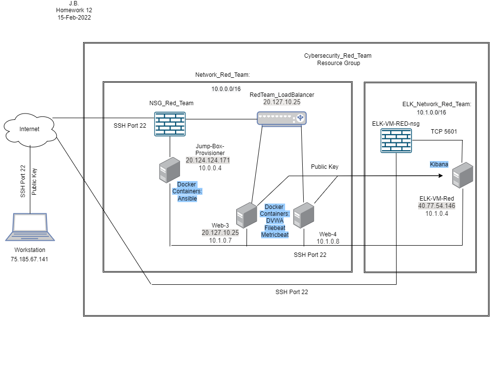
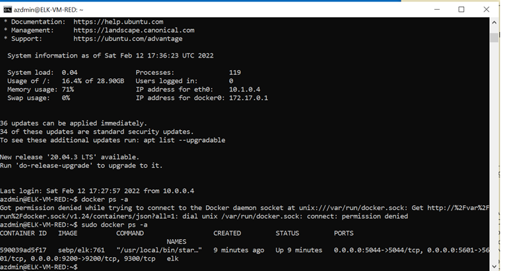
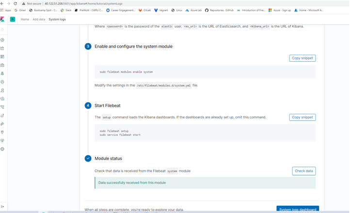
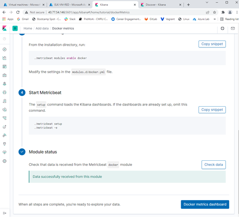

## Automated ELK Stack Deployment

The files in this repository were used to configure the network depicted below.

These files have been tested and used to generate a live ELK deployment on Azure. They can be used to either recreate the entire deployment pictured above. Alternatively, select portions of the yml file may be used to install only certain pieces of it, such as Filebeat.

  - install-elk.yml

This document contains the following details:
- Description of the Topology
- Access Policies
- ELK Configuration
  - Beats in Use
  - Machines Being Monitored
- How to Use the Ansible Build

### Description of the Topology

The main purpose of this network is to expose a load-balanced and monitored instance of DVWA, the D*mn Vulnerable Web Application.

- Load balancing ensures that the application will be highly available, in addition to restricting traffic to the network.
- The Jump Box serves as a first level connection controls the automation of the remainig VM with docker containers. Another advantage of the jump box that it increases the security by reducing the attacking surface of the system.

Integrating an ELK server allows users to easily monitor the vulnerable VMs for changes to the data and system logs. This is accomplished with:
- Filebeat: Collects logs/data about the the system and forwards them on.  
- Metricbeat: Collects system metrics and forwards them on. 

The configuration details of each machine may be found below.

| Name     | Function 	  | IP Address 		| Operating System |
|----------|--------------|-----------------|------------------|
| Jump Box | Gateway  	  | 10.0.0.4   		| Linux            |
| Web-3    | Webserver1	  | 10.0.0.7   		| Linux            |
| Web-4    | Webserver2	  | 10.0.0.8   		| Linux            |
| LB       | Loadbalancer | 20.127.10.25	| Linux            |
| ELK      | Monitoring	  | 10.1.0.4   		| Linux            |

### Access Policies

The machines on the internal network are not exposed to the public Internet. 

Only the Jumpbox machine can accept connections from the Internet. Access to this machine is only allowed from the following IP addresses:
- 75.185.67.141

Machines within the network can only be accessed by Jump Box Provisioner. This includes the ELK server which has an an address of 10.1.04.

A summary of the access policies in place can be found in the table below.

| Name     | Publicly Accessible | Allowed IP Addresses |
|----------|---------------------|----------------------|
| Jump Box | Yes                 | 75.185.67.141	    |
| Web-3    | No                  | 10.0.0.4             |
| Web-4    | No                  | 10.0.0.4             |
| ELK      | No                  | 10.0.0.4             |

### Elk Configuration

Ansible was used to automate configuration of the ELK machine. No configuration was performed manually, which is advantageous because time can be saved by quickly deploying multiple services across various virtual machines. 

The playbook implements the following tasks:
- Installs Docker.io, Python3-pip, and Docker module
- Increases virtual memory and allows for it to be used. 
- Downloads and launches a docker ELK container
- Enables the service docker on boot

The following screenshot displays the result of running `docker ps` after successfully configuring the ELK instance.

### Target Machines & Beats
This ELK server is configured to monitor the following machines:
- Web-3 (10.0.0.7)
- Web-4 (10.0.0.8)

We have installed the following Beats on these machines:
- Filebeat
- Metricbeat

These Beats allow us to collect the following information from each machine:
- Filebeat is a lightweight shipper for forwarding and centralizing log data. Installed as an agent on servers, Filebeat monitors the log files or locations that you specify, collects log events, and forwards them either to Elasticsearch or Logstash for indexing. When you start Filebeat, it starts one or more inputs that look in the locations specified for log data. For each log that Filebeat locates, Filebeat starts a harvester. Each harvester reads a single log for new content and sends the new log data to libbeat, which aggregates the events and sends the aggregated data to the output that you’ve configured for Filebeat. The information collected are typically logs related to access of the system. 
- Metricbeat is a lightweight shipper that periodically collects metrics from the operating system and from services running on the server. Metricbeat takes the metrics and statistics that it collects and ships them to the output that you specify, such as Elasticsearch or Logstash. The information collected are typically CPU and Memory usage. 

### Using the Playbook
In order to use the playbook, you will need to have an Ansible control node already configured. Assuming you have such a control node provisioned: 

SSH into the control node and follow the steps below:
- Copy the ansible.cfg file to /etc/ansible. Update the ansible.cfg file to include to user name, VM IPs and ansible_python_interpreter=/usr/bin/python3 to the hosts & in the ansible.cfg.
- Copy the filebeat-config.yml file and run filebeat-playbook.yml.
- Copy the metricbeat-config.yml file and fun metricbeat-playbook.yml.
- After running the playbook, and navigate to kibana website to check that the installation worked as expected by verifying that data has succesfully loaded as illustrated in the two images below:

